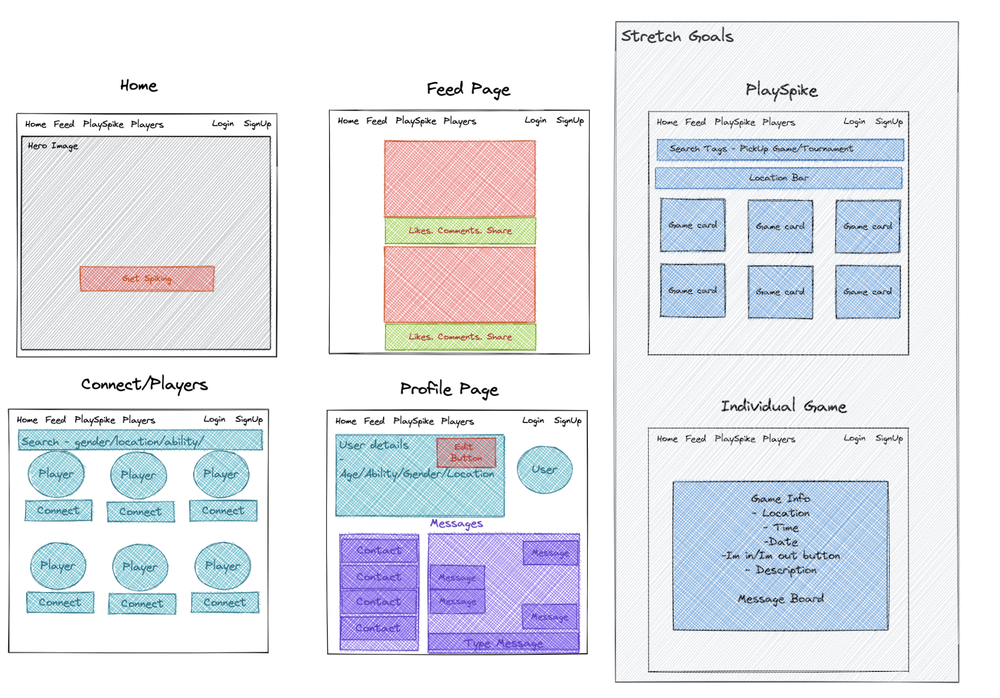
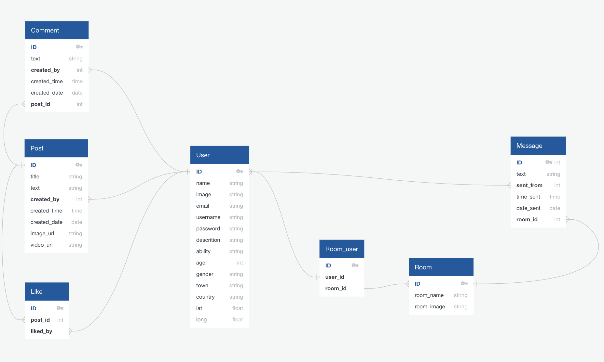
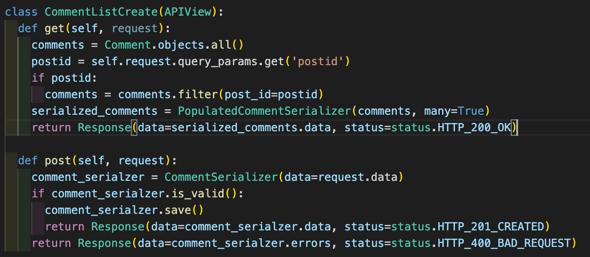
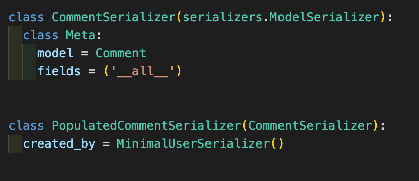
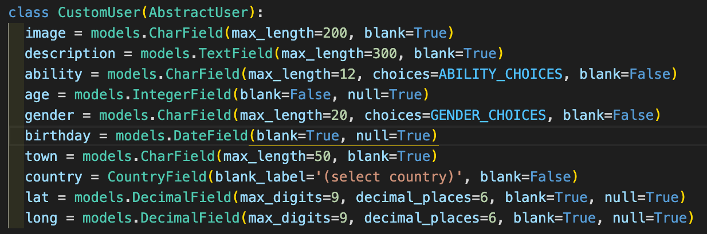
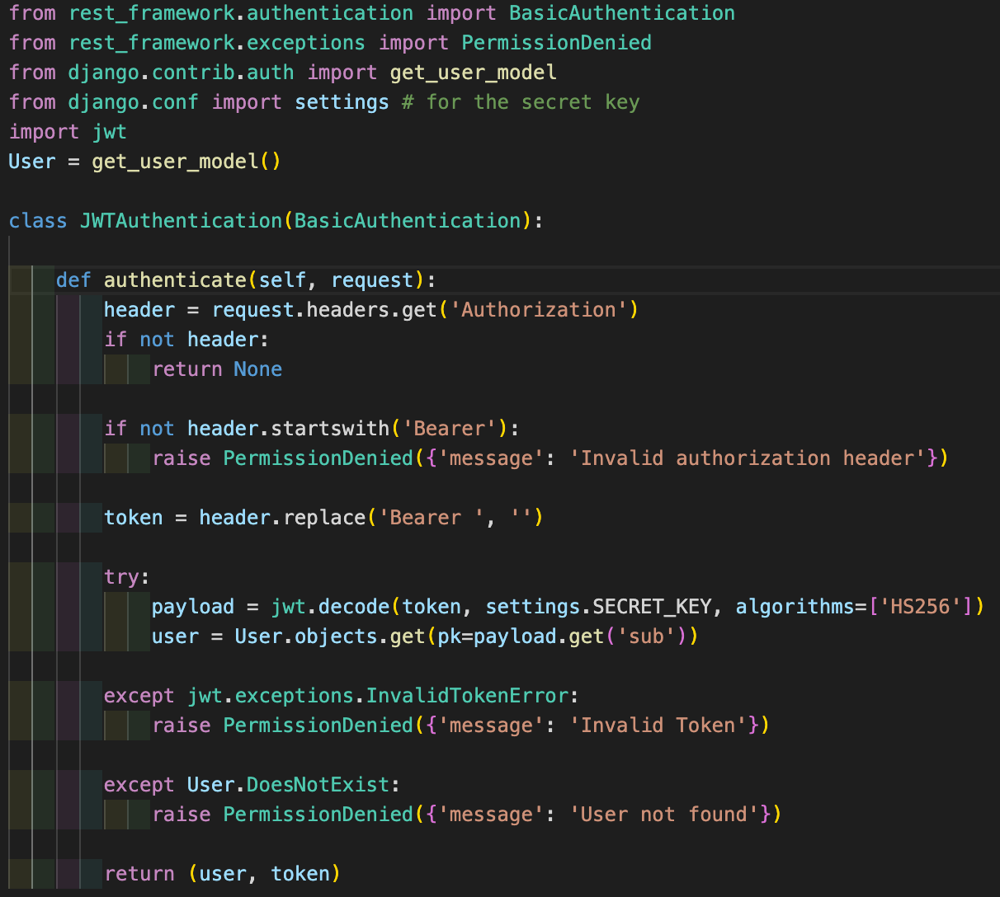
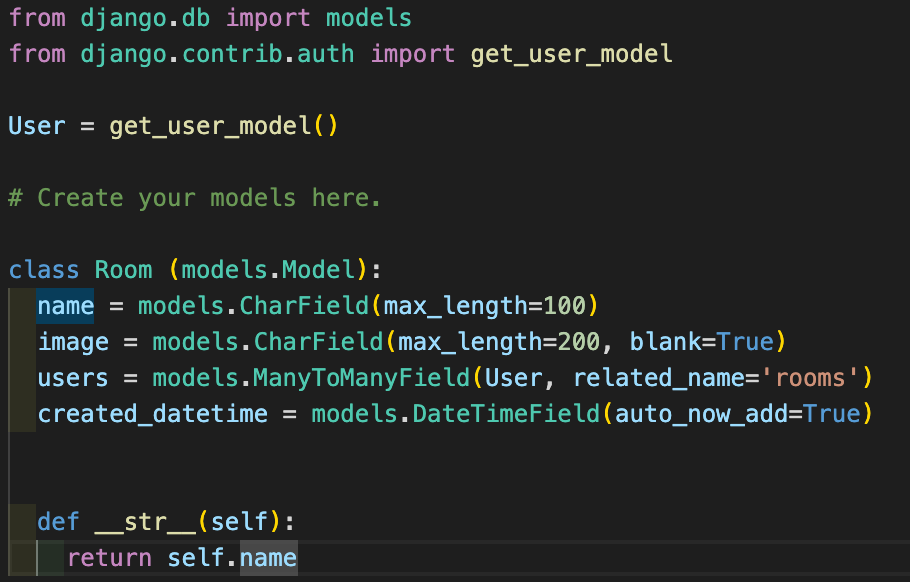
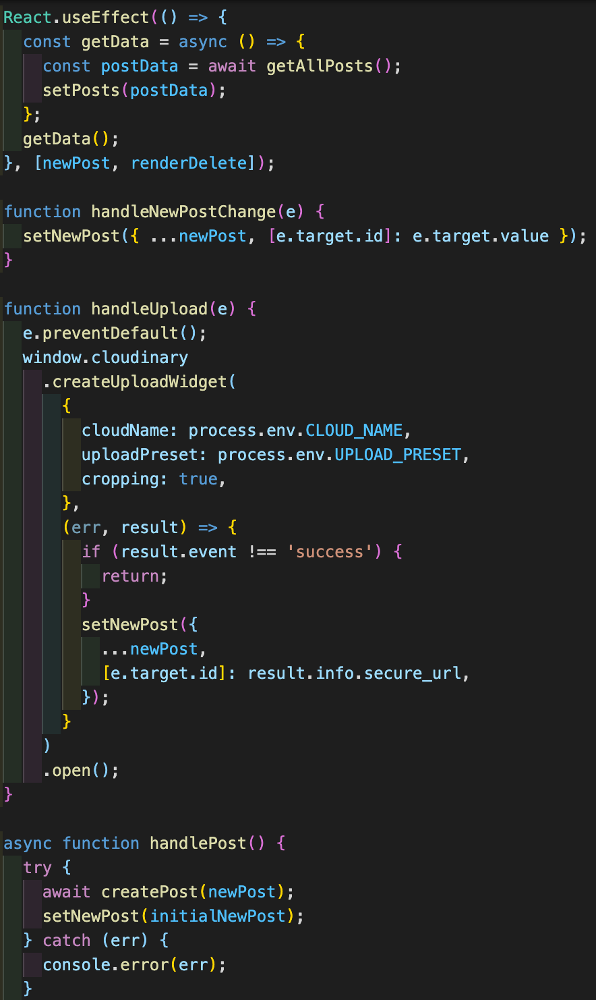
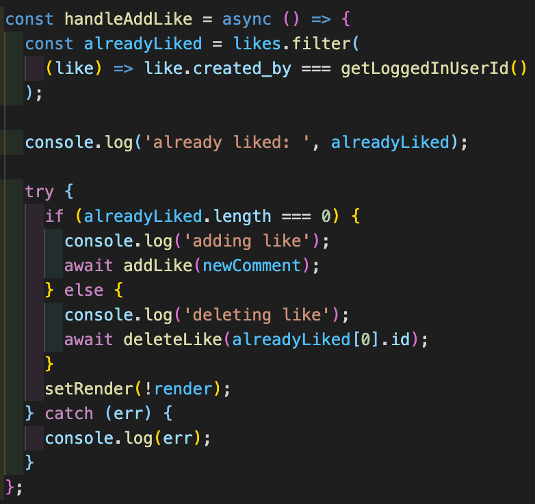
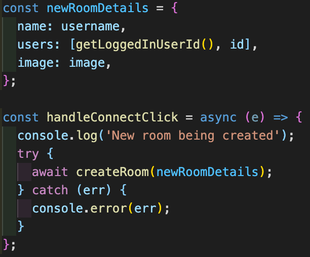

# Spike Squad - GA SEI Project 4

## Project Overview

Spike Squad is a full stack app that uses a Mongo database in the backend, which serves a React frontend. The project was a solo project, completed within 7 days. The app is designed to allow Spike Ball players to meet and collaborate with one another by sharing their latest Spike Ball news/images/videos in the news feed and organise meetups by using the in-app messaging.

**TECHNOLOGIES USED:** HTML, CSS/Sass, JavaScript, React, Tailwind, Axios, Node.js, Python, PostgreSQl, Django, Netlify, Heroku,

**LINK:**

# The Brief

- **Build a full-stack application** by making your own backend and your own front-end.
- **Use a Python Django API** using Django REST Framework to serve your data from a Postgres database.
- **Consume your API with a separate front-end** built with React.
- **Be a complete product** which most likely means multiple relationships and CRUD functionality for at least a couple of models.
- **Implement thoughtful user stories/wireframes** that are significant enough to help you know which features are core MVP and which you can cut.
- **Have an entity relationship diagram** showing your proposed database schema.
- **Have a visually impressive design** to kick your portfolio up a notch and have something to wow future clients & employers. **ALLOW** time for this.
- **Be deployed online** so it's publicly accessible.

## Approach

### **1) Planning**

Planning this app was crucial. With it being such an extensive app with a large amount of functionality it was important to understand exactly what was needed in the frontend before beginning to build the back end. I set about wireframing my app with Excalidraw and once I had decided upon final product functionality, I broke down the separate models into relationship diagrams, which clearly laid out the linkages between each piece of data. These can be seen in the diagrams below.

### **2) Functionality**

#### Backend

Once the relationship diagram was clearly defined, building the backend was not too challenging. It was a good opportunity to become more familiar with the flow of Django. One by one, I created separate apps for each model of my relationship diagram. This included: chats, comments, jwt_auth, likes, posts and rooms. On creation of each model, I also completed the serializers.py and views.py folders for each. The apps used a mixture of django generic views and more detailed views depending on the requirements of the app. An example of a more detailed view is the 'CommentListCreate' view, as seen below, which shows the use of query params to allow for filtering of the data based on the postid.

On occasions I used nested serializers in the apps to allow for displaying more comprehensive data. Here the example is the 'PopulatedCommentSerializer' which inherited from the CommentSerializer, but also populated the 'created_by' data using the 'MinimalUserSerializer' defined in the jwt_auth serializers.

The user was a large part of my backend and required a number of additional fields that the typical django user model does not contain. I therefore created a user model called 'CustomUser' within the jwt_auth app, which inherited from the django 'AbstractUser' model. This model is also a good example of the range of field authentication I used, including; 'CharField' with a set length and 'Country Field'.

In addition to the user model, the jwt_auth app also includes token authentication. First of all, this required the installation of JWT library using 'pipenv install pyjwt'. I then wrote an authentication.py file which can be seen below. This file runs a number of checks - firstly, that there is an 'Authorization' header and that it starts with 'Bearer'. If this exists, the token is extracted from the header, by removing the 'Bearer' string from it and decoded. This returns a payload, which includes a 'sub' value which was assigned to the token at Login and this can be used to retrieve the user from the database. The token is checked that it is valid and if it is not, or the user does not exist, a 'Invalid Token' message is returned. If the process is successful however, a tuple containing the user and the token is returned.

The final pieces of code to talk through in the backend is the successful implementation of One to Many and Many to Many relationships. An example of the many to many relationship in the Room model can be seen below.

#### Frontend

On completion of my django backend and a well structured wireframe plan, it set me up well to create the front end without too many issues. Once my React app foundation was in place I began breaking down the frontend work into separate components. My first focus with the Feed.js and FeedCard.js components.

##### Feed.js, FeedCard.js

The Feed.js component has two main parts to it, the feed cards, which are created for each post individually using the FeedCard.js component and secondly, the ability to create a new post. On page load, the React.useEffect() is called which in turn fetches all the posts from the backend server via an axios call. This data is then set to state in 'posts' and the 'posts' state is mapped over and the FeedCard.js component rendered for each. The creation of a new post is done relatively simply, using a form and a piece of state called 'newPost'. For any change in the form fields by the user, the newPost data is updated to reflect that in a succinct way using 'e.target.id'. This also includes the addition of a separate function to manage the upload of an image or video to Cloudinary, which returns a url and this is stored in the 'newPost' state also. On the click of the post button, the handlePost function is called and creates a new post by POSTing to the backend server using axios and passing the 'newPost' state. The posts are re-rendered on the page automatically by adding the newPost state to the dependency array, meaning that on the creation of a new post the post data is re-fetched from the backend server.

The secondary component to Feed.js is the FeedCard.js. As mentioned this is called when the 'posts' data is mapped over and in each case the specific post data is passed as props to FeedCard.js. The post data passed by props is simply displayed on the page. In addition to this post information is the likes and comments. These are both pieces of state that the React.useEffect() initialises by sending a request to the backend server for the comment and likes data for the particular post id using query params. In the same way new posts are created in the Feed.js component (as described above) new likes and new comments are also created using the same piece of state 'newComment' as this has the same data required for both. The additional functionality added for the likes is ensuring that the same user cannot add a like more than once, so once they have already liked the post, the like button turns to an unlike button. The boolean piece of state called 'setRender', is added to the React.useEffect() dependency array, so onChange re-fetches the data and updates the page to include the likes and comments.

##### Connect.js, PlayerCard.js and Profile.js

The next set of components I considered were the Connect.js, PlayerCard.js and Profile.js components. These were very straight forward and consisted mostly of displaying data on the page, which was either passed by props (in the case of the PlayerCard.js), accessed by the 'useParams' hook (in the case of the Profile.js) or the data was fetched using axios in a React.useEffect() on page load. The most complex bit of these three components was the creation of a new chat room when the connect button was clicked in the PlayerCard.js component. A const called newRoomDetails was created with the name of the chat room, the users involved and the image. This was then passed onClick using axios to the backend server and a new chat room created.

##### Messenger.js and NewChat.js

The Messenger.js and NewChat.js components were among the hardest components to construct in this project. The Messenger.js component has a number of pieces of state, which are updated on various user actions. The ‘currentRoomId’ and ‘currentRoomInfo’ are dependent on which chat room the user clicks on - upon click these two pieces of state are updated and the page red-rendered with the latest information. The ‘userRooms’ state is used to display the list of chat rooms the user is a part of; the ‘roomSearch’ updates onChange of the search form and displays any matching rooms; ‘chats’ is the messages in a chat room, which updates dependent on the ‘currentRoomId’; and finally, the ‘newMessage’ and ‘newRoomInfo’ pieces of state are used for the creation of a new chat and new room respectively.

##### Login.js, SignUp.js, Home.js and Navbar.js

In comparison to the other components above, these four components were very simple to construct. The SignUp and Login components are tailwind constructed forms that onChange update the pieces of state linked to them. The SignUp page also incorporates a secondary API from restcountries.com, to provide a suitable drop down list for the country input. On submit of these forms they send a POST request to the backend server passing the data within the state. (The login functionality also saves the returned jwt-token to session storage).

The Home component is a simple hero image with a button that takes the useNavigate hook for the react-router-dom library and directs the user to the signup page if they are not yet logged in, or to the feed page if they are. The Navbar uses the Link and useNavigate hooks, also from the react-router-dom library to direct the user to the correct location on clicking of the text. e.g. clicking feed directs the user to the feed page. The Navbar elements are displayed depending on if the user is logged in or not, which is assessed using the getLoggedInUserId() function in the lib/auth.js file whose purpose is to return the user id from the token stored in session storage.

##### Styling

Other than a few hero images, the vast majority of styling was done using tailwind (a CSS framework). This was my first experience of tailwind, but I became proficient with it and enjoyed the increased control compared to using a framework such as Bulma.

## Wins & Blockers

### **Wins:**

- A successfully functioning and extensive full stack app, with a large amount of functionality, a clean user experience and created within 7 days was a great achievement.
- Creating a working chat app, with many to many relationships, within the overall app
- A large amount of functionality in such a small period of time, including extensive user interactiveness, including 'like' and 'commenting' functionality whilst being able to interact with other Spike Squad users using posts and chats.
- My first app that was styled with tailwind. I taught myself this CSS framework whilst building the app and am pleased with the overall results and now have a good grasp of tailwind

### **Blockers:**

- The chat app backend was challenging to get to grips with initially. However, after some extensive thought I have developed a successful backend which allows for a large amount of frontend functionality, including group chats.
- Using components within components initially caused issues with re-rendering the displayed page once the pieces of state changed, but I resolved this issue by declaring the state in the primary component and then passing it as props to the secondary component.

## Bugs

- On the last day of the project, I noticed that the way I have set up the backend model for the chat rooms, does not allow for a seperate room image depending on who is logged in. For example, if the current user (user1) starts a chat with a second user (user2), the chat image will be user2's profile image. However, if user2 then logs in, the chat still has user2's profile image as the chat image, when in fact in should be user1's image. This can be relatively easily resolved by added a further field to the 'Room' model on the backend.

## Future Improvements

- Progress the frontend internal chat app to allow group chats.
- Improved styling, particularly in the chat app, which allows scrolling of messages and of chat rooms.

## Key Takeaways

After completing a 12 week course, this was a great project to complete solo and solidify all of my learning. I am extremely happy with the amount of functionality I achieved in such a short space of time. There are a number of stretch goals and slight improvements I would like to make to the app in the long term, including the addition of group messaging and a 'pickup game' section, but to have achieved the amount of successful functionality I did within 7 days, I am very proud of. Being able to work with many to many relationships in Django gave me a much greater understanding of the backend and how it comes together. Planning the build process and expecting outcome was key and I understood quickly how important it was to understand exactly what was needed in the frontend before starting to build the backend.

## Contact:

- Github: github.com/FouldsEJ
- Linkedin: linkedin.com/in/edwardfoulds
- Portfolio: edwardfoulds.co.uk
